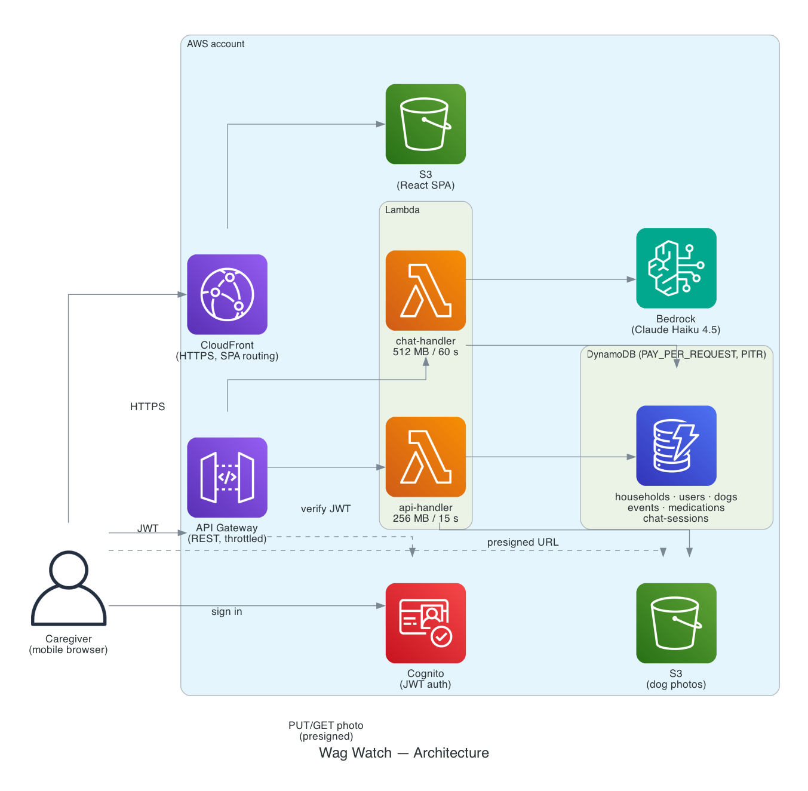

# 🐾 Wag Watch

> Keep a close, caring eye on the health trends that keep your dog's tail wagging.

A mobile-friendly web app for tracking the daily health of senior dogs.
Multiple caregivers in a household log events throughout the day, manage
medications, visualize trends over time, and chat with an AI assistant that
analyzes the dog's history.

Built on AWS. Serverless. Cheap to run.

---

## Architecture



A single-page React app served from CloudFront talks to a Cognito-authorized
API Gateway. Two Lambda functions (one general API, one Bedrock-powered chat)
read and write DynamoDB and issue pre-signed URLs for photo uploads to a
private S3 bucket.

Everything is defined in TypeScript CDK and deploys as five CloudFormation
stacks:

| Stack | Purpose |
|-------|---------|
| `DogTrackerDatabase` | 6 DynamoDB tables with GSIs, point-in-time recovery, TTL |
| `DogTrackerAuth` | Cognito user pool, app client, hosted domain |
| `DogTrackerStorage` | S3 bucket for dog photos (CORS locked to frontend) |
| `DogTrackerApi` | API Gateway + API Lambda + Chat Lambda |
| `DogTrackerFrontend` | S3 site bucket + CloudFront distribution |

To regenerate the diagram after you change infrastructure:
```bash
pip install diagrams && brew install graphviz   # one-time setup
python3 docs/generate-architecture-diagram.py
```

---

## Features

- **Quick event logging** — one tap to record potty accidents, medical events,
  behavior changes, meals, and daily ratings
- **Medication management** — track dosage, frequency, start/stop, and history
- **Multi-dog, multi-caregiver households** — share health data via invite codes
- **Calendar heatmap** of day ratings over time
- **Trend charts** for accidents, medical events, and daily ratings
- **AI chat** — ask questions about your dog's recent history; the assistant
  queries DynamoDB via tool use and grounds its answers in real data
- **PDF + CSV exports** for your vet (formula-injection sanitized)
- **Timezone-aware** event logging and daily rollups

---

## Quick Start

### Prerequisites

- **Node.js 20+** and **npm 9+** — [install](https://nodejs.org)
- **AWS CLI v2**, configured with credentials that can create Lambda, DynamoDB,
  Cognito, API Gateway, CloudFront, and S3 — [install](https://aws.amazon.com/cli/)
- An AWS account you control

You do **not** need the CDK CLI installed globally; `npx cdk` is used everywhere.

### One-command deploy

```bash
git clone <this-repo> wag-watch
cd wag-watch
./deploy.sh
```

The script runs about 8–12 minutes on a first deploy. It will:

1. Check prerequisites (Node 20+, AWS CLI, AWS credentials)
2. Warn if Bedrock Claude Haiku 4.5 isn't available in your region
3. Install all npm dependencies (backend, frontend, cdk)
4. Build the Lambda bundles
5. Bootstrap CDK in your account if needed (idempotent)
6. Deploy all five stacks
7. Extract the Cognito / API / CloudFront outputs and write `frontend/.env`
8. Build the frontend with those values baked in
9. Upload the built frontend to its S3 bucket

At the end it prints your CloudFront URL. Open it on your phone and sign up.

**Options:**
```bash
./deploy.sh --region us-east-1      # pick a different region (default: us-west-2)
AWS_DEFAULT_REGION=eu-west-1 ./deploy.sh
```

### Enable AI chat (required for the chat feature)

The AI chat uses Amazon Bedrock with **Anthropic Claude Haiku 4.5**. You have
to enable the model once, per region:

1. Go to the [Bedrock model access page](https://console.aws.amazon.com/bedrock/home#/modelaccess)
   in the region you deployed to.
2. Click **Enable specific models**.
3. Enable **Anthropic → Claude Haiku 4.5**.
4. Access is usually granted within a minute.

Until this is done, every other feature works, but the chat page will show an
error when you try to send a message. `deploy.sh` warns you if it can't find
the model in your region — if that happens, pick a different region or request
access and redeploy.

**Regions with Claude Haiku 4.5 access as of this writing:** `us-east-1`,
`us-east-2`, `us-west-2`, `eu-west-1`, `ap-northeast-1`. Confirm the current
list on the [Bedrock region page](https://docs.aws.amazon.com/bedrock/latest/userguide/models-regions.html)
before deploying elsewhere.

### (Optional) Sign in with Google

1. Create OAuth credentials in the
   [Google Cloud Console](https://console.cloud.google.com/apis/credentials).
2. Store the client secret in AWS Secrets Manager:
   ```bash
   aws secretsmanager create-secret \
     --name dog-tracker/google-oauth \
     --secret-string '{"clientSecret":"YOUR_GOOGLE_CLIENT_SECRET"}'
   ```
3. Edit `cdk/lib/stacks/auth-stack.ts` — uncomment the Google IdP block and
   paste in your client ID.
4. Redeploy: `cd cdk && npx cdk deploy DogTrackerAuth --require-approval never`

---

## Estimated Monthly Cost

Target workload: a two-person household, 1–2 dogs, ~10 events logged per day,
~5 AI chat queries per day.

| Service | Usage | Monthly cost |
|---------|-------|-------------:|
| Cognito | < 50 MAUs | $0.00 (free tier) |
| API Gateway | ~15K requests | $0.00 (free tier) |
| Lambda | ~15K invocations, <100 GB-seconds | $0.00 (free tier) |
| DynamoDB (PAY_PER_REQUEST) | <10K reads, <5K writes | $0.00 (free tier) |
| S3 (site + photos) | <100 MB, <1K requests | $0.00 (free tier) |
| CloudFront | <1 GB egress, <10K requests | $0.00 (free tier for 12 months) |
| Bedrock Claude Haiku 4.5 | ~150 queries, small context | ~$0.50–$1.00 |
| CloudWatch Logs | ~50 MB ingest, 30-day retention | ~$0.05 |
| **Total** | | **≈ $0.55–$1.05** |

Scaling up the AI chat is what moves the needle:

| AI chat usage | Queries/day | Approx Bedrock cost |
|---------------|------------:|--------------------:|
| Light | 5 | ~$0.50–$1.00 |
| Moderate | 20 | ~$2.00–$4.00 |
| Heavy | 50 | ~$5.00–$10.00 |
| Heavy + long context | 100 | ~$15.00–$25.00 |

Bedrock pricing is per-token and varies with input/output size. The API
Gateway usage plan caps each stage at 50 req/s, and the chat route is
throttled to 2 req/s to prevent runaway bills.

Prices assume AWS Free Tier is not exhausted by other workloads. See the
[AWS Pricing Calculator](https://calculator.aws/) for account-specific
estimates.

---

## Development

### Run frontend locally

```bash
cd frontend
npm install
cp .env.example .env    # fill in values from an existing deployment
npm run dev             # http://localhost:5173
```

The frontend's `.env` is auto-generated by `deploy.sh`, so if you've deployed
at least once you can just run `npm run dev` without editing anything.

### Run tests

```bash
cd backend && npm test                # 68 tests (Jest)
cd backend && npm run test:coverage   # with coverage report
cd backend && npm run typecheck       # src + tests

cd cdk && npm test                    # ~20 infrastructure tests (Jest)

cd frontend && npx vitest run         # unit + component tests (Vitest)
cd frontend && npx playwright test    # e2e (requires running dev server)
```

### Redeploy after code changes

Fastest path for small changes:

```bash
cd backend && npm run build
cd ../cdk && npx cdk deploy DogTrackerApi --require-approval never
```

If you changed the frontend:

```bash
cd frontend && npm run build
cd ../cdk && npx cdk deploy DogTrackerFrontend --require-approval never
```

Or just run `./deploy.sh` again — it's idempotent.

### Project structure

```
wag-watch/
├── deploy.sh                   # one-command deploy
├── destroy.sh                  # teardown
├── README.md
├── LICENSE                     # MIT
├── SECURITY.md                 # vulnerability reporting
├── docs/
│   ├── architecture.png        # architecture diagram
│   └── generate-architecture-diagram.py
├── backend/                    # Lambda code (TypeScript, bundled by esbuild)
│   ├── src/
│   │   ├── api-handler.ts      # main API Lambda
│   │   ├── chat-handler.ts     # Bedrock chat Lambda
│   │   ├── auth-context.ts     # JWT claim extraction
│   │   ├── validation.ts       # shared input validators
│   │   ├── db.ts               # DynamoDB client
│   │   └── handlers/           # dogs, events, medications, households
│   └── tests/                  # Jest tests
├── frontend/                   # React 19 + Vite + Tailwind 4
│   ├── src/
│   │   ├── components/         # UI building blocks
│   │   ├── contexts/           # Auth, Dog providers
│   │   ├── lib/                # API client, charts, exports
│   │   └── pages/              # Home, History, Trends, Chat, Settings
│   ├── e2e/                    # Playwright tests
│   └── .env.example
└── cdk/                        # AWS CDK (TypeScript)
    ├── bin/cdk.ts              # app entry point
    └── lib/stacks/             # 5 CDK stacks
```

---

## Security

Production-relevant defaults:

- **Cognito**: 12-char minimum passwords, upper + lower + digit + symbol,
  `preventUserExistenceErrors` on, `userSrp`-only auth (no plaintext password
  flow)
- **Invite codes**: 16 chars from `crypto.randomBytes` (~96 bits entropy),
  indexed by GSI, invalidated on first successful join
- **API Gateway**: stage throttle 50 rps / 100 burst, chat route 2 rps / 5
  burst, per-stage quota of 10K requests/day
- **CORS**: S3 photos bucket scoped to the CloudFront domain + `localhost:5173`
- **Input validation**: length, format, and range checks on every handler
- **CSV exports**: formula-injection sanitized (`= + - @ \t \r` neutralized)
- **Prompt injection**: user-supplied dog fields are wrapped in delimiters with
  explicit "treat as data" instructions; `dogId` for tool calls is always
  server-injected from the auth context, never from model output
- **Lambda logs**: 30-day retention; no PII in logs
- **Source maps**: not shipped to Lambda by default
- **DynamoDB**: AWS-managed encryption at rest, PITR on all tables,
  `RemovalPolicy.RETAIN` on all data tables

Things you may want to add before putting this in front of strangers:

- CloudFront response-headers policy (CSP, HSTS, X-Content-Type-Options)
- AWS WAF with a rate-based rule
- MFA enforcement on Cognito (currently off)
- A per-user daily quota on the chat endpoint (today it's per-stage)

See `SECURITY.md` for the disclosure policy.

---

## Cleanup

```bash
./destroy.sh
```

The script will delete all five CloudFormation stacks. **DynamoDB tables and
the photos S3 bucket are retained by design** — to fully clean up, remove
them manually from the AWS Console:

- DynamoDB tables prefixed `dog-tracker-`
- S3 bucket prefixed `dogtrackerstorage-photosbucket`

---

## License

[MIT](LICENSE)
